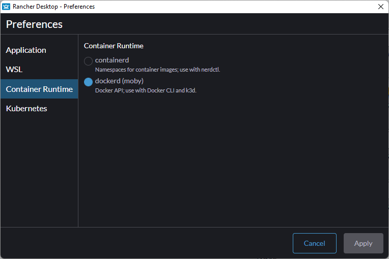
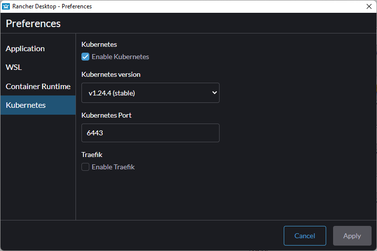

# TRABAJO PRACTICO ARQUITECTURA DE SOFTWARE II

Trabajo practico sobre contenedores y micro-servicios de ARQUTECTURA DE SOFTWARE 2 @ UNAHUR

## Herramientas

- Rancher Desktop (obligatorio)
- Chocolatey (para windows): Facilita la instalacion de software en windows utilizando un Package Manager como `apt-get`
- `choco install make marktext -Y` POWERSHELL EN MODO ADMINISTRADOR
  - MAKE: Permite ejecutar archivos make en windows
  - MARKTEXT: Editor de texto markdown

## Clúster de destino

El clúster de prueba es un **Rancher Desktop** con la siguiente configuración





**Inicializar el cluster**

Para inicializar el clister ejecute el comando `make init-k8-cluster` en el directorio raíz de este repositorio

Ese comando hará lo siguiente

- Instalar **NGINX Ingress Controller** + **Cert Manager** + **SELF SIGNED CLUSTER ISSUER**
- Instalar **kube-prometheus**

## Objetivos

El trabajo practico se divide

### MINIMO REQUERIDO _(5 puntos)_

Transformar la solución existente de `docker-compose` a Kubernetes con los siguientes requerimientos

- Todo el trabajo debe estar contenido en un namespace con su nombre (Juan Perez= jperez)
- Recursos por POD
- Detección de Fallos
- Configuración Utilizando *ConfigMaps *y *Secrets*
- Los servicios deben ser de tipo ClusterIp
- Instructivo de implementación (puede ser dentro del README.ms)
- Diagrama de la solución (puede ser una imagen o diagrama de app.diagrams.net DENTRO DEL REPOSITORIO)

VERIFICACION:

1. Hacer Fordward del servicio de API a una dirección en localhost. Por ejemplo si se desea exponer el puerto 8080 del servicio `mf-api` en <http://localhost:8081> se debe ejecutar el siguiente comando:
   
   ```bash
   kubectl port-forward mf-api 8081:8080 -n jperez
   ```

2. Acceder a la dirección asignada en el paso anterior subpath `/swagger`. Para el ejemplo anterior <http://localhost:8081/swagger>

3. Ejecutar los endpoints con resultado `HTTP STATUS 200`

### EXTRA: INGRESS + HTTPS 2 _(3 puntos)_

Exponer los servicios necesarios vía ingress y HTTPS

- Exponer la API REST en `https://api.<<nombre de namespace>>.localdev.me/api`

- Exponer la interface Swagger en `https://api.<<nombre de namespace>>.localdev.me/swagger`

- Los endpoints de métricas NO DEBEN ESTAR EXPUESTOS

VERIFICACION:

2. Acceder a `https://api.<<nombre de namespace>>.localdev.me/swagger`

3. ejecutar los endpoints con resultado `HTTP STATUS 200`

### EXTRA: MONITOREO _(2 puntos)_

Conectar los *endpoint* de monitoreo al sistema de monitoreo del clúster utilizando el CRD `ServiceMonitor` y verificar utilizando la intancia de grafana de monitoreo en https://mon.localdev.me usuario `admin` clave `prom-operator`.

Hay un dashboard de ASP.NET disponible para verificar la conexión de los servicios.

## Requisitos de entrega

Se generara un repositorio **PRIVADO** de GitHub , con permisos de colaborador para el usuario **rbrea-edu**

Estructura de directorios

- `./src` Archivo/s `yaml` con la solución propuesta

- `./README.md` con el instructivo de implementación

- `./docs` imágenes y diagrama/s de la solución

Para entregas parciales o totales la solución debe poder implementarse sin errores utilizando `NO MAS DE 3 LINEAS DE COMANDOS`
